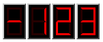
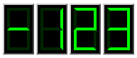

# seven-segment

An Elm package to render seven-segment displays with configurable fidelity. You can either

- Use the low-level `SevenSegment.view` to render a single seven-segment display.
- Or `SevenSegment.intView` to render an integer.

## Examples



```elm
example : Html msg
example =
    SevenSegment.intView
        (SevenSegment.Config.init { widthPixels = 16 })
        (NumberOfDigits 4)
        -123
```



```elm
example : Html msg
example =
    SevenSegment.intView
        (SevenSegment.Config.init { widthPixels = 16 }
            |> Config.withColors
              { backgroundColor = { red = 0, green = 0, blue = 0 }
              , foregroundColor = { red = 0, green = 255, blue = 0 }
              }
        )
        (NumberOfDigits 4)
        -123
```
